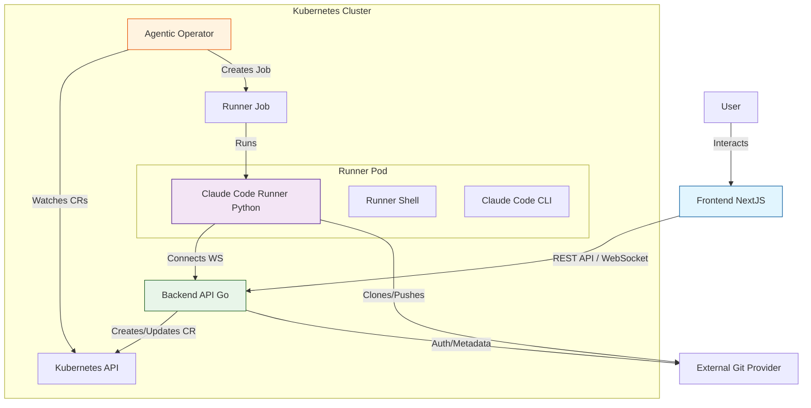
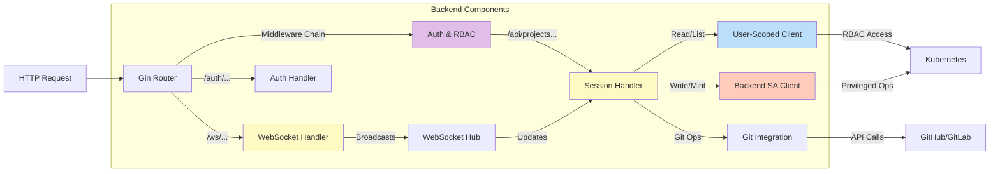
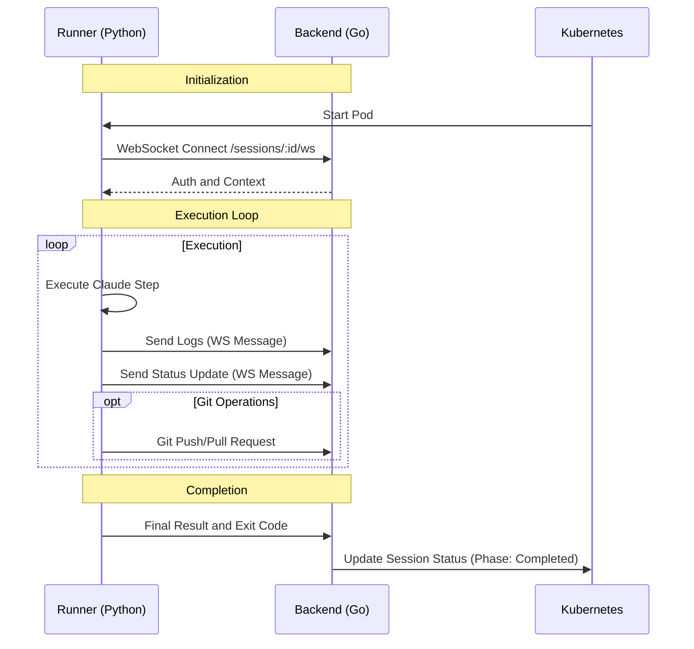
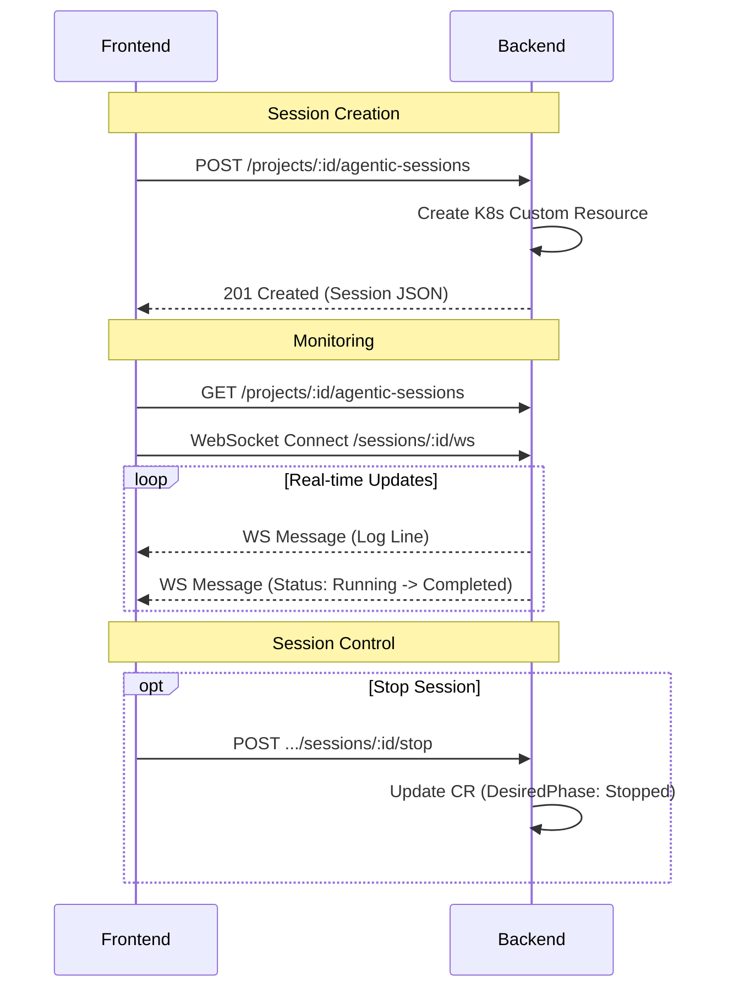
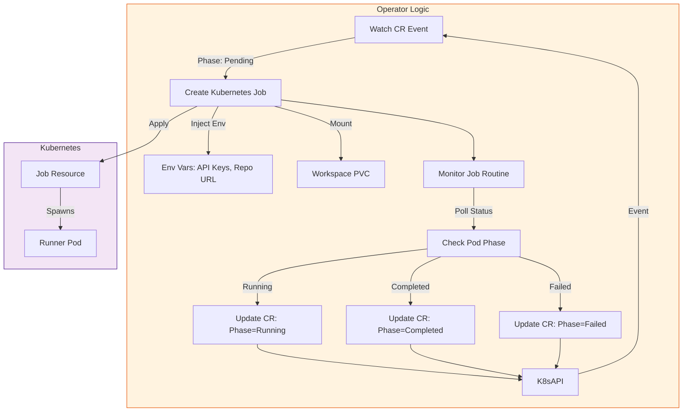
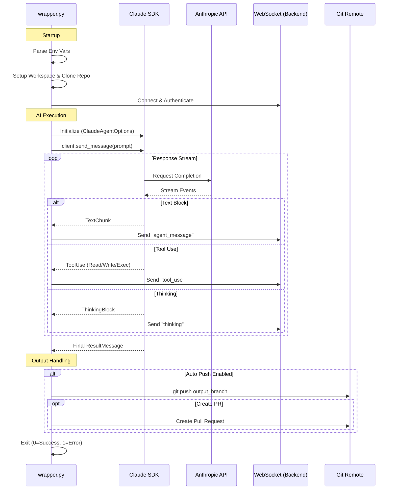

# Architecture Workflows

Visual diagrams explaining how components interact in the Ambient Code Platform.

**Last Updated:** 2025-12-04

**For:** New contributors understanding the system

## Diagrams
### 1. High-Level System Architecture
This chart describes how the main components (Frontend, Backend, Operator, Runner) interact to execute an agentic session.

#### Workflow Explanation
1.  **User** starts a session in the **Frontend**.
2.  **Frontend** calls **Backend** to create an `AgenticSession` Custom Resource (CR) in Kubernetes.
3.  **Operator** watches for the new CR and creates a Kubernetes **Job** running the **Runner** image.
4.  **Runner** starts up, connects back to the **Backend** via WebSocket, and executes the **Claude Code CLI**.
5.  Real-time logs and status are sent from Runner -> Backend -> Frontend.

---

### 2. Backend Internal Interactions
This chart details how the Backend service is organized and handles requests.

#### Key Internal Flows
-   **Session Management:** `handlers/sessions.go` uses user-scoped clients for reads/validation and the backend service account for CR writes after RBAC authorization.
-   **Real-time Updates:** `websocket/` package manages connections from both the Frontend (users) and Runners (agents).
-   **Git Integration:** `git/` and `github/` packages handle token exchange and repository operations.
-   **Authentication & RBAC:** All user operations validated with user bearer tokens; backend service account used only for privileged operations after authorization checks.

---

### 3. Backend <-> Runner Interaction
This chart focuses on the communication between the running Agent (Runner) and the Backend.

#### Details
-   **Communication:** The Runner uses a wrapper (`wrapper.py`) around the `runner-shell` library to establish a persistent WebSocket connection.
-   **Protocol:** Messages include logs, status changes, and content synchronization.
-   **State:** The Backend updates the Kubernetes CR status based on these messages, which the Operator eventually observes.

---

### 4. Frontend <-> Backend Interaction
This chart shows how the User Interface communicates with the Backend.

#### Key Interactions
-   **API Services:** Located in `frontend/src/services/api/`, these TypeScript modules handle strongly-typed REST calls.
-   **Live Data:** The frontend subscribes to the same WebSocket channels that the Runner publishes to, allowing users to see the agent's "thought process" and terminal output in real-time.

---

### 5. Operator <-> Runner Lifecycle
This chart illustrates how the Operator manages the Runner's lifecycle from creation to completion.

#### Lifecycle Details
-   **Provisioning:** The Operator detects a new `AgenticSession` CR (Phase: Pending) and creates a batch `Job`.
-   **Configuration:** It injects critical environment variables (e.g., `ANTHROPIC_API_KEY` or `CLAUDE_CODE_USE_VERTEX`, `GIT_REPO_URL`) and mounts a Persistent Volume Claim (PVC) for the workspace.
-   **Monitoring:** A dedicated goroutine polls the Job/Pod status and updates the CR's `status.phase` accordingly.
-   **Cleanup:** If the session is stopped (DesiredPhase: Stopped), the Operator deletes the Job and Pods.

---

### 6. Runner Internal Execution Flow
This chart details the internal logic of the `wrapper.py` script running inside the container.

#### Execution Details
-   **Engine:** The runner uses the **Claude Code SDK** (Anthropic) to drive the agentic loop. It does **not** currently use the OpenAI API, though the architecture is extensible.
-   **Streaming:** All "thoughts", terminal outputs, and tool executions are streamed in real-time to the user via the WebSocket connection.
-   **Output:**
    1.  **Real-time:** The conversation stream.
    2.  **Persistent:** Changes made to the filesystem (code edits) are persisted in the PVC and optionally pushed to the remote Git repository (`git push`) upon completion.
